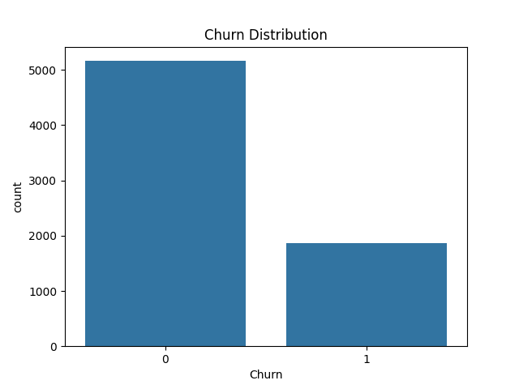
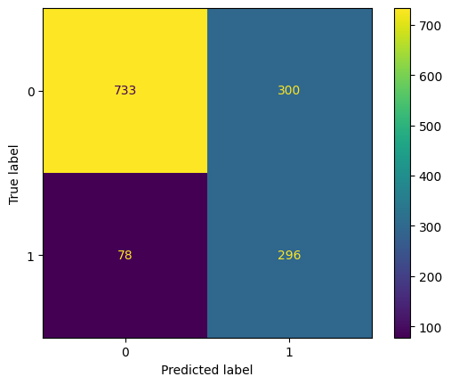

🚀 Predicting customer churn with 79% recall using class imbalance handling

# 📉 Customer Churn Prediction

## 📌 Overview
This project predicts whether a customer is likely to churn (leave the company) using machine learning techniques. The goal is to help businesses identify at-risk customers and take preventive action.

---

## 🎯 Business Problem
Customer churn directly impacts revenue. Retaining existing customers is often cheaper than acquiring new ones.

This model helps:
- Identify high-risk customers  
- Improve retention strategies  
- Support data-driven decision-making  

---

## 📂 Dataset
- Telco Customer Churn Dataset (Kaggle)
- Contains customer demographics, services, and account information

---

## ⚙️ Tech Stack
- Python
- Pandas, NumPy
- Seaborn, Matplotlib
- Scikit-learn

---

## 🔍 Workflow

1. Data Cleaning  
   - Converted `TotalCharges` to numeric  
   - Removed missing values  

2. Feature Engineering  
   - One-hot encoding of categorical variables  

3. Model Building  
   - Logistic Regression  
   - Random Forest  

4. Handling Imbalance  
   - Used `class_weight='balanced'`  

---

## 📊 Results

### 🔹 Before Handling Imbalance
- Recall (Churn): **0.52**

### 🔹 After Handling Imbalance
- Recall (Churn): **0.79** ✅

👉 Significant improvement in detecting churn customers

---
## 💼 Business Impact

- Identifying churn-prone customers allows proactive retention
- Improving recall means fewer customers are lost
- Even a small improvement can lead to significant revenue savings
  
---

## 📈 Visualizations

### 🔹 Churn Distribution


### 🔹 Confusion Matrix


---

## 🧠 Key Insights

- Handling class imbalance significantly improves model performance  
- Accuracy alone is misleading for imbalanced datasets  
- Logistic Regression outperformed Random Forest for recall  

---

## 🚀 Future Improvements

- Use advanced models (XGBoost, LightGBM)  
- Hyperparameter tuning  
- Deploy model using Streamlit  

---

## 📎 How to Run

```bash
pip install -r requirements.txt
